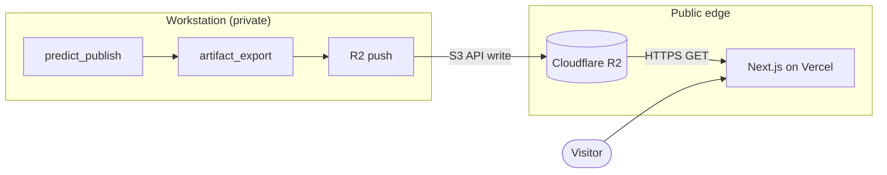

# Ridge — Public Predictions Webapp Specification

**Document type:** Product + technical specification (read-only forecasting site)  
**Status:** W0 — spec only; no application code in this task  
**Authority:** Parent system spec is `docs/DESIGN.md`; this document governs the public webapp only.

Ridge is a read-only view over `predict_publish` outputs. It is **not** a betting-recommendations product: no picks, no lines, no edge claims, anywhere on the site or in its artifacts.

---

## §1 — Published Artifact Contract

Ridge consumes **versioned JSON artifacts** pushed to Cloudflare R2 by the workstation as the final step of `predict_publish`. The webapp never calls CFBD, the Odds API, MLflow, Prefect, or the workstation. All displayed numbers originate in these files.

Evidence for current backend shapes is recorded in `docs/notes/webapp-spec.md` (StampedPrediction, StaleContext, RefreshKind from `pipelines/predict.py`; distributional pass-through from `evaluation/walkforward.py`).

### 1.1 Artifact inventory

| File | Scope | Updated |
|------|-------|---------|
| `meta.json` | Site-wide pointers and provenance | Every publish |
| `week_predictions.json` | Current season/week FBS slate | Every publish |
| `results_<season>.json` | Graded completed games for one season | After each postgame ingest + grade export |
| `track_record.json` | Aggregate evaluation metrics (23-readout) | On promotion or quarterly refresh |
| `team_ratings_<season>.json` | Stage-1 rating trajectories | Weekly (Sun 06:00) + on publish |

All files share the same `published_at` ISO-8601 UTC timestamp for a given publish generation. Object keys are versioned: `v{schema_version}/{season}/w{week}/{refresh_kind}/week_predictions.json` plus an `latest/` alias symlinked by the push script.

### 1.2 `week_predictions.json`

Top-level object:

```json
{
  "schema_version": "1.0.0",
  "season": 2024,
  "week": 5,
  "refresh_kind": "tuesday_primary",
  "published_at": "2024-10-01T10:00:00Z",
  "feature_time_label": "FEATURE_TIME=TUESDAY_DECISION",
  "ensemble_scope_label": "REDUCED_PER_ADR_0013",
  "vintage_label": "REGRADED_V2",
  "model_identity": {
    "registry_name": "ncaa-quant",
    "champion_version": 3,
    "model_version": "production-v0_reduced_v1",
    "run_id": "851a6408fd3248a394a351a026672648"
  },
  "publish_stale": {
    "is_stale": false,
    "combined_stamp": null,
    "sources": []
  },
  "games": [ /* GamePrediction[] */ ]
}
```

#### `GamePrediction` — per-game record

| Field | Type | Source (backend) | Notes |
|-------|------|------------------|-------|
| `game_id` | string | CFBD `game_id` | Stable key |
| `season` | int | schedule | |
| `week` | int | schedule | CFBD week |
| `home_team` | string | staged `teams.school` | Display name |
| `away_team` | string | staged `teams.school` | Display name |
| `home_team_id` | int | schedule | For rating trajectories |
| `away_team_id` | int | schedule | For rating trajectories |
| `kickoff_utc` | string (ISO-8601) | `GamesSchema.start_date` | Always UTC |
| `neutral_site` | bool | schedule | |
| `conference_game` | bool | schedule | |
| `mu_margin` | float \| null | `pred_margin` | Home-minus-away expected margin (points). Positive favors home. |
| `sigma_margin` | float \| null | `sigma_m` | Margin predictive SD (points) |
| `sigma_margin_credible` | bool | `!sigma_m_is_missing && null_reason == null` | ADR 0014 σ refusal |
| `margin_interval_lo` | float \| null | `cqr_lo` or `pred_margin_q05` | Lower bound (points, home margin scale) |
| `margin_interval_hi` | float \| null | `cqr_hi` or `pred_margin_q95` | Upper bound |
| `margin_interval_nominal` | float \| null | `cqr_nominal` | Nominal coverage (e.g. 0.90) |
| `mu_total` | float \| null | `pred_total` | Expected combined score |
| `sigma_total` | float \| null | `sigma_t` | Total predictive SD |
| `sigma_total_credible` | bool | `!sigma_t_is_missing && null_reason == null` | |
| `total_interval_lo` | float \| null | conformal / quantile | |
| `total_interval_hi` | float \| null | conformal / quantile | |
| `total_interval_nominal` | float \| null | | |
| `p_win_home` | float \| null | `p_ml_home` | Home win probability |
| `p_win_home_credible` | bool | `!p_ml_home_is_missing` | Suppressed when σ refused |
| `p_cover_home` | float \| null | `p_ats_home` | **Model-internal cover prob only** — not vs a published line; display label "cover (model ref)" in UI copy |
| `p_cover_home_credible` | bool | `!p_ats_home_is_missing` | |
| `p_over` | float \| null | `p_ou_over` | Over prob vs model total ref |
| `p_over_credible` | bool | `!p_ou_over_is_missing` | |
| `conviction_tier` | string \| null | computed at export | `"strong_lean"` \| `"lean"` \| `"toss_up"` \| null |
| `conviction_team` | string \| null | computed at export | Team school name |
| `conviction_label` | string \| null | computed at export | e.g. `"Strong lean Michigan"` |
| `conviction_basis` | object | computed at export | See §2 |
| `tier_primary` | string \| null | stored Tue primary tier | Tier at Tuesday primary publish |
| `tier_revised_since_primary` | bool | computed at export | True when current tier ≠ `tier_primary` |
| `is_stale` | bool | `StampedPrediction.is_stale` | Per-game stale inputs |
| `stale_stamp` | string \| null | `StampedPrediction.stale_stamp` | e.g. `"STALE(odds, 4.0h)"` |
| `stale_sources` | array | `StaleContext.sources[]` | `{ source, age_hours, last_good_at }` |
| `null_reason` | string \| null | ADR 0014 | e.g. `cold_start_insufficient` |
| `vintage_label` | string | run metadata | e.g. `REGRADED_V2` |
| `ensemble_scope_label` | string | run metadata | e.g. `REDUCED_PER_ADR_0013` |
| `feature_time_label` | string | run metadata | e.g. `FEATURE_TIME=TUESDAY_DECISION` |
| `published_at` | string (ISO-8601) | publish run clock | Same as file-level unless row re-stamped |
| `refresh_kind` | string | `RefreshKind` | See enum below |

**`RefreshKind` enum** (from `pipelines/predict.py`):

| Value | Schedule (UTC) |
|-------|----------------|
| `tuesday_primary` | Tue 06:00 |
| `daily_refresh` | Thu–Sat 06:00 |
| `t_minus_6h` | T−6h before kickoff (operator-wired) |
| `t_minus_1h` | T−1h before kickoff (operator-wired) |

**FBS scope:** all scheduled FBS games for the target `(season, week)` — regular season and postseason FBS matchups. FCS opponents appear as the away/home team name but the game is included when it is on the FBS schedule ingest (`classification=fbs`).

**Odds API exclusion:** no spread, total, moneyline, book, or market-implied field appears in this contract. `p_cover_home` and `p_over` are derived from the model's own μ/σ (and internal reference total/spread used only for probability construction), never from captured sportsbook lines.

### 1.3 `results_<season>.json`

Graded past games for one season. Each row pairs the **last pre-kickoff publish** with realized outcomes.

Top-level:

```json
{
  "schema_version": "1.0.0",
  "season": 2024,
  "published_at": "2024-12-15T08:00:00Z",
  "grading_rule": "last_pre_kickoff_publish",
  "games": [ /* GradedGame[] */ ]
}
```

#### Grading rule — which publish snapshot grades a game

For each completed game, select the prediction row with the latest `published_at` strictly **before** `kickoff_utc` among publishes for that `(game_id)`:

1. Prefer highest-precedence `refresh_kind`: `t_minus_1h` > `t_minus_6h` > `daily_refresh` > `tuesday_primary`.
2. Within the same kind, take the latest `published_at`.
3. If no pre-kickoff publish exists (data gap), the game is **excluded** from results with `grade_status: "no_pre_kickoff_publish"`.

This mirrors the production decision-point ladder in DESIGN §9.8 and ensures grades reflect what Ridge would have shown before kickoff, not postgame knowledge.

#### `GradedGame` record

| Field | Type | Notes |
|-------|------|-------|
| `game_id` | string | |
| `week` | int | |
| `kickoff_utc` | string | |
| `home_team`, `away_team` | string | |
| `home_points`, `away_points` | int | Final including OT |
| `actual_margin` | int | `home_points − away_points` |
| `actual_total` | int | Sum of scores |
| `graded_from` | object | `{ refresh_kind, published_at }` — winning snapshot |
| `mu_margin`, `sigma_margin` | float \| null | As published pre-kickoff |
| `margin_interval_lo`, `margin_interval_hi`, `margin_interval_nominal` | float \| null | |
| `mu_total`, `total_interval_*` | float \| null | |
| `p_win_home` | float \| null | As published |
| `conviction_tier`, `conviction_team`, `conviction_label` | various | As published pre-kickoff |
| `margin_interval_hit` | bool \| null | `lo ≤ actual_margin ≤ hi`; null if interval absent |
| `total_interval_hit` | bool \| null | Same for total interval |
| `home_win` | bool | `actual_margin > 0` |
| `p_win_home_realized` | float \| null | 1.0 or 0.0 for Brier post-hoc; not displayed as a "pick" |
| `grade_status` | string | `"graded"` \| `"no_pre_kickoff_publish"` |

### 1.4 `track_record.json`

Frozen aggregate metrics from `docs/notes/23-readout.md` (corrected v2, closed 2026-08-13). Numbers are **verbatim** — no rounding, restating, or softening. Every rate carries bootstrap 95% CI bounds and `n`.

```json
{
  "schema_version": "1.0.0",
  "published_at": "2026-08-13T00:00:00Z",
  "source_memo": "docs/notes/23-readout.md",
  "ensemble_scope_label": "REDUCED_PER_ADR_0013",
  "vintage_labels": ["REGRADED_V2", "RERUN_V2"],
  "verdict": {
    "label": "NOT CURRENTLY FIT TO BET",
    "plain_language": "Point-prediction machinery is credible (weekly MAE curve passes, MAE/CRPS sane, A2 Clause A confirms in-season learning on the rating engine) but no edge vs the close is demonstrated (ATS straddles ~50% on fundamental REGRADED_V2; log-loss loses universally to 0.693; CLV unmeasurable) and two §1.6 instruments remain unmeasurable (CLV; honest OU via possessions)."
  },
  "metrics": [ /* TrackRecordMetric[] */ ]
}
```

#### `TrackRecordMetric` record

| Field | Type | Required |
|-------|------|----------|
| `id` | string | Stable key (e.g. `fund_ats_snapshots`) |
| `label` | string | Display label exactly as in 23-readout |
| `value` | number \| string | Point estimate or `NOT COMPUTED` |
| `unit` | string | `"percent"` \| `"points"` \| `"ratio"` \| `"none"` |
| `ci_lower` | number \| null | Bootstrap 95% lower; null when not computed |
| `ci_upper` | number \| null | Bootstrap 95% upper |
| `ci_kind` | string | `"bootstrap_95"` \| `"naive_95"` \| `"none"` |
| `n` | int \| null | Sample size |
| `regime` | string \| null | e.g. `"snapshots 2021–24"`, `"CFBD 2019"` |
| `vintage` | string | e.g. `REGRADED_V2` |
| `run` | string \| null | e.g. `fundamental`, `A4` |
| `notes` | string \| null | Caveats verbatim from memo |

**Required metric rows** (minimum set — see notes file for full enumeration):

- Fundamental ATS snapshots: **50.7%**, CI **[48.7%, 52.7%]**, n=**3496**
- Fundamental ATS CFBD 2019: **51.3%**, CI **[48.3%, 54.3%]**, n=**743**
- Fundamental OU snapshots: **52.3%**, CI **[49.7%, 54.8%]**, n=**3136**
- Fundamental OU CFBD 2019: **50.9%**, CI **[46.6%, 55.4%]**, n=**747**
- MAE margin continual vs A2 frozen: **14.85** vs **16.45** (Δ **+1.60**), n=4375 all-season
- CRPS margin continual vs A2: **10.68** vs **11.87** (Δ **+1.20**)
- ATS log-loss band: **0.82–1.04** vs market baseline **0.693**
- §1.6 scorecard rows with `MISSED` / `UNMEASURABLE` labels preserved
- Verdict string: **NOT CURRENTLY FIT TO BET**

### 1.5 `meta.json`

```json
{
  "schema_version": "1.0.0",
  "published_at": "2024-10-01T10:00:00Z",
  "season": 2024,
  "week": 5,
  "refresh_kind": "tuesday_primary",
  "next_expected_publish_utc": "2024-10-03T10:00:00Z",
  "champion_model": {
    "registry_name": "ncaa-quant",
    "champion_version": 3,
    "model_version": "production-v0_reduced_v1",
    "registered_at": "2024-08-01T12:00:00Z"
  },
  "publish_schedule": {
    "primary": "Tue 06:00 UTC",
    "refresh": "Thu–Sat 06:00 UTC",
    "postgame_ratings": "Sun 06:00 UTC"
  },
  "artifact_pointers": {
    "week_predictions": "latest/week_predictions.json",
    "track_record": "latest/track_record.json",
    "results_current_season": "latest/results_2024.json",
    "team_ratings": "latest/team_ratings_2024.json"
  },
  "feature_time_label": "FEATURE_TIME=TUESDAY_DECISION",
  "ensemble_scope_label": "REDUCED_PER_ADR_0013",
  "vintage_label": "REGRADED_V2"
}
```

### 1.6 `team_ratings_<season>.json`

Stage-1 posterior snapshots for rating-trajectory charts (Game Detail). Exported from the Kalman rating history after weekly update.

```json
{
  "schema_version": "1.0.0",
  "season": 2024,
  "published_at": "2024-10-01T10:00:00Z",
  "teams": {
    "<team_id>": {
      "school": "Michigan",
      "weeks": [
        {
          "week": 1,
          "as_of_utc": "2024-08-31T10:00:00Z",
          "off_epa": 0.12,
          "def_epa": -0.08,
          "pace": 72.1,
          "off_sd": 0.04,
          "def_sd": 0.05
        }
      ]
    }
  }
}
```

v1 uses `off_epa` and `def_epa` (4-dim Stage-1 block). Uncertainty bands use `off_sd` / `def_sd` (posterior marginal SD). Values are **relative** (league mean-centered per DESIGN §9.3).

### 1.7 Versioning and evolution rules

- **`schema_version`:** SemVer string on every artifact. **Major** bump = breaking field removal or type change **or semantic redefinition of an existing field or enum value** (e.g. moving the `strong_lean` enter threshold) → frontend renders site-wide **maintenance state** (see §3.2). **Minor** bump = additive fields only → frontend ignores unknown fields. **Patch** bump = documentation/clarification only. *Exception (W1A):* `schema_version` **1.1.0** used a minor bump despite redefining `strong_lean`'s threshold only because no pre-amendment Ridge artifacts were ever published (`webapp.export_enabled` OFF through W1); this must not be read as permitting the pattern once readers exist.
- **Additive-only policy:** New fields are appended; existing fields are never repurposed in-place.
- **Frontend on version mismatch:** If `schema_version.major` ≠ supported major, render maintenance page: *"Ridge is updating — check back shortly."* Do **not** guess, interpolate, or render partial data from an unsupported schema.
- **Fixture artifacts** used in development must declare `"fixture": true` at file top level.

### 1.8 Missing-value policy

**Contract:** JSON `null` means *absent / not computed*. The frontend renders honest absence (`"—"`, `"not computed"`), never zero-fills, never interpolates, never substitutes league averages.

| Field null | Meaning | UI treatment |
|------------|---------|--------------|
| `mu_margin` | ADR 0014 null block (`null_reason` set) | "Forecast unavailable" + reason tooltip |
| `sigma_margin` | σ refused (block-constant or missing) | Hide σ-dependent visuals; suppress tiers |
| `margin_interval_*` | Conformal/quantile not emitted | Omit interval band |
| `mu_total` | Total head null | Secondary column shows "—" |
| `p_win_home` / `p_cover_home` / `p_over` | σ-gated refusal | "not computed"; no probability bar |
| `*_credible: false` | Field present but not trustworthy | Render value dimmed or hidden per field rules |
| `conviction_tier` | Suppressed (see §2.3) | No tier chip |
| `stale_stamp` | Fresh inputs | No per-game stale badge |
| `null_reason` non-null | Explicit ADR gap | Show in provenance footnote |

When `sigma_margin_credible` is false, **all** probability fields are treated as not credible regardless of their `*_credible` flags (σ-gating is authoritative per ADR 0014).

---

## §2 — Conviction Tier Definition

Conviction tiers describe the **forecast of game outcome** — which team is favored and how decisively — using **model outputs only**. They are not recommendations of any kind.

### 2.1 Input quantity

**Primary input:** `p_favored`, the win probability of the favored team:

```
favored_side = "home" if mu_margin >= 0 else "away"
p_favored    = p_win_home           if favored_side == "home"
             = 1 - p_win_home       if favored_side == "away"
```

**Why `p_win_home` (not raw `|mu|/sigma`):** Win probability integrates margin uncertainty into a single outcome-relevant scale, directly supports team-named labels ("Strong lean Michigan"), and is already σ-gated via ADR 0014. The export also records `mu_sigma_ratio = |mu_margin| / sigma_margin` in `conviction_basis` for audit.

**Tie-break:** When `mu_margin == 0`, favored side is `"home"` if `p_win_home >= 0.5`, else `"away"`.

### 2.2 Tier boundaries

> **AMENDED per W1A (2026-08-13).** Four tiers replace the W1 three-tier ladder.
> `schema_version` bumped to **1.1.0** (minor — additive `clear_lean` enum value;
> `strong_lean` threshold moved). No pre-amendment Ridge artifacts were ever
> published (`webapp.export_enabled` remained OFF through W1), so there is no
> reader in the wild to migrate.
>
> **Rationale:** Historical walkforward (task23_fundamental_reduced_v2, 2019–2024,
> n=4,944) showed the superseded Strong-enter at 0.65 captured 63.0% of games
> (71.2% in the worst season). The amended ladder spreads conviction across four
> bands: pooled **strong_lean 17.3%**, **clear_lean 32.9%**, **lean 30.8%**,
> **toss_up 18.9%**; worst-season top two tiers (clear+strong) **58.6%** (2022).

Tiers are determined by `p_favored`:

| Tier | Enter when | Label template |
|------|------------|----------------|
| **Strong lean** | `p_favored ≥ 0.85` | `Strong lean {Team}` |
| **Clear lean** | `0.70 ≤ p_favored < 0.85` | `Clear lean {Team}` |
| **Lean** | `0.575 ≤ p_favored < 0.70` | `Lean {Team}` |
| **Toss-up** | `p_favored < 0.575` | `Toss-up` (no team name) |

`{Team}` is `home_team` or `away_team` per `favored_side`.

<details>
<summary>Superseded W1 boundaries (2026-08-13, pre-W1A)</summary>

| Tier | Enter when | Label template |
|------|------------|----------------|
| **Strong lean** | `p_favored ≥ 0.65` | `Strong lean {Team}` |
| **Lean** | `0.55 ≤ p_favored < 0.65` | `Lean {Team}` |
| **Toss-up** | `p_favored < 0.55` | `Toss-up` |

Degeneracy finding on fixture week 2024 w5: 67.9% Strong lean (38/56 games).
</details>

### 2.3 Hysteresis

To avoid flicker across Thu–Sat refreshes, tiers use **asymmetric enter/exit bands** (±0.03 from enter threshold):

| Tier | Enter | Exit (hold until) |
|------|-------|-------------------|
| Strong lean | `p_favored ≥ 0.85` | `p_favored < 0.82` |
| Clear lean | `p_favored ≥ 0.70` | `p_favored < 0.67` |
| Lean | `p_favored ≥ 0.575` | `p_favored < 0.545` |
| Toss-up | `p_favored < 0.575` | `p_favored ≥ 0.605` (promotes to Lean) |

<details>
<summary>Superseded W1 hysteresis bands</summary>

| Tier | Enter | Exit (hold until) |
|------|-------|-------------------|
| Strong lean | `p_favored ≥ 0.65` | `p_favored < 0.62` |
| Lean | `p_favored ≥ 0.55` | `p_favored < 0.52` |
| Toss-up | `p_favored < 0.55` | `p_favored ≥ 0.58` (promotes to Lean) |
</details>

**Multi-boundary exit:** When `p_favored` exits a tier's hold band and the raw tier (§2.2) differs by more than one step from the prior tier, the tier **reassigns directly to the raw tier** — it does not descend one band at a time. Example: prior tier Strong lean, refresh yields `p_favored=0.68` (raw Lean) → tier becomes **Lean**, not Clear lean.

**Flap exposure (measurement status):** Historical walkforward flap exposure (task23, 2019–2024, n=4,944): **42.1%** of games have `p_favored` within ±0.03 of any tier boundary (union of three bands). This measures **boundary proximity**, not realized intra-week tier flicker. Realized Tue→Sat tier-change counts are **NOT MEASURED** from existing artifacts (walkforward emits one row per game at the Tuesday decision point only). Status: **UNRESOLVED** until W7 deploy instruments per-publish tier-change counts (`game_id`, prior tier, new tier, `hysteresis_applied`), reported after the first four live publish weeks of 2026. The amended ladder is accepted **provisionally** on the hypothesis that ratings move little between Tuesday and Saturday for teams that have not played — a hypothesis, not a measurement.

**State:** Export maintains `tier_state` keyed by `(season, game_id)` on the workstation. Each publish:

1. Compute raw tier from §2.2 boundaries.
2. Apply hysteresis vs previous tier.
3. Write resulting `conviction_tier` to artifact.
4. Store Tuesday-primary tier as `tier_primary` on the Tue 06:00 `tuesday_primary` publish.
5. Set `tier_revised_since_primary = (conviction_tier != tier_primary)` for non-primary refreshes.

### 2.4 Suppression conditions

`conviction_tier`, `conviction_team`, and `conviction_label` are **`null`** (chip hidden) when **any** of:

1. `sigma_margin_credible == false` (ADR 0014 σ refusal)
2. `p_win_home_credible == false`
3. `mu_margin == null` or `p_win_home == null`
4. `is_stale == true` **and** any `stale_sources[].age_hours > 6.0` (matches `pipeline.stale_odds_max_age_hours`)
5. Offseason / no publish for the game

### 2.5 "Revised since Tuesday primary" marker

When `tier_revised_since_primary == true` **and** `conviction_tier` is not suppressed:

- Game Detail shows a quiet **"Revised"** badge (semantic color `--color-revised`; see §4.1).
- Tooltip: *"Conviction tier changed since Tuesday primary publish ({tier_primary} → {conviction_tier})."*
- This Week list may show a dot indicator; no alert styling.

### 2.6 `conviction_basis` object (exported)

```json
{
  "p_favored": 0.68,
  "p_win_home": 0.68,
  "mu_margin": 4.2,
  "sigma_margin": 13.8,
  "mu_sigma_ratio": 0.304,
  "favored_side": "home",
  "hysteresis_applied": true,
  "previous_tier": "lean",
  "raw_tier": "strong_lean"
}
```

### 2.7 Worked examples (ILLUSTRATIVE)

**Example A — Strong lean (home):**  
`mu_margin=+12.0`, `sigma_margin=14.0`, `p_win_home=0.88`, `sigma_margin_credible=true`  
→ `p_favored=0.88` → **Strong lean {Home Team}**

**Example B — Clear lean (home):**  
`mu_margin=+7.0`, `sigma_margin=14.0`, `p_win_home=0.74`, `sigma_margin_credible=true`  
→ `p_favored=0.74` → **Clear lean {Home Team}**

**Example C — Lean (away):**  
`mu_margin=−2.5`, `sigma_margin=13.5`, `p_win_home=0.42`  
→ `p_favored=0.58` → **Lean {Away Team}**

**Example D — Toss-up:**  
`mu_margin=+0.5`, `sigma_margin=14.0`, `p_win_home=0.51`  
→ `p_favored=0.51` → **Toss-up**

**Example E — Hysteresis hold:**  
Previous tier = Lean (home). Refresh yields `p_favored=0.56` (below 0.575 raw threshold but above 0.545 exit).  
→ Tier **remains Lean** (`hysteresis_applied: true`).

**Example F — Suppression:**  
`sigma_margin=null`, `sigma_margin_credible=false`, `null_reason="cold_start_insufficient"`  
→ `conviction_tier=null`; UI shows margin if present without tier chip.

---

## §3 — Architecture

### 3.1 Data flow



**Sequence:**

1. **Tue 06:00 / Thu–Sat 06:00 UTC** — Prefect `predict_publish` runs on workstation.
2. **`artifact_export`** — maps production predictions + schedule + tier state → JSON artifacts (§1).
3. **`r2_push`** — uploads to R2 with `latest/` pointers; POST Vercel **on-demand revalidation** webhook (secret in workstation `.env` only).
4. **Next.js** — Server Components fetch from R2 public URL (or Cloudflare Worker proxy if bucket is private-with-signed-edge); cache with ISR.
5. **Pages** render read-only views; no mutation endpoints in v1.

**Revalidation strategy:**

| Mechanism | When |
|-----------|------|
| On-demand revalidation | After every successful R2 push (primary) |
| Time-based ISR fallback | `revalidate: 21600` (6 h) on layout |
| `meta.json` poll | Layout reads `published_at`; triggers client soft navigation hint |

**Freshness equivalence:** Site content is as fresh as the latest artifact generation. After Tue 06:00 primary, `published_at` ≈ Tue 06:00 UTC; after Thu–Sat refresh, `published_at` updates accordingly. The UI displays `published_at` on every page (see §5).

### 3.2 Failure modes — two staleness kinds

| Kind | Trigger | Scope | UI |
|------|---------|-------|-----|
| **Site staleness** | `now − meta.published_at > 36 h` **and** past next expected publish slot | Whole site | Top banner: *"Data may be stale — last updated {published_at}"*; pages still render last artifacts |
| **Input STALE stamp** | `predict_publish` ingest failure; `StaleContext` active | Per game | Badge: `STALE(odds, 4.0h)` from `stale_stamp`; tier suppressed if age > 6 h (§2.4) |

**Workstation down:** R2 retains last-good artifacts; Vercel serves cached pages; site staleness banner engages per table above. This is the **accepted failure mode** — no silent refresh, no live fallback API.

**Schema mismatch:** Maintenance state; no data render.

### 3.3 Security boundary

| Asset | Exposure | Notes |
|-------|----------|-------|
| R2 bucket objects (JSON) | **Private**; server-side credentialed read (SigV4) | No public object URLs. Next.js Server Components fetch with read-only R2 API credentials in Vercel server env. World-readable public-read is **not** the live posture. |
| Vercel app | **Public** (operator-accepted for launch readiness) | Static + SSR; env vars = R2 read credentials + revalidation secret (server-only). `noindex` via `X-Robots-Tag` + `robots.ts`. |
| R2 write credential | **Workstation only** | Never in Vercel, never in git |
| MLflow UI | **Never public** | DESIGN §10; localhost bind |
| Prefect UI | **Never public** | DESIGN §10 |
| Workstation / DuckDB / Parquet | **Never public** | No inbound ports |
| CFBD / Odds API keys | **Workstation only** | Webapp consumes zero credits (§3.5) |

#### Public-read R2 — DEFERRED

W0 described R2 as “Public read via HTTPS.” W7 shipped a **private** bucket with SigV4 server-side reads (`webapp/site/src/lib/artifacts/r2.ts`). Public-read remains deferred for these reasons on record:

1. **Field surface:** Public object URLs would publish every artifact field, not only every rendered field (see W8-A D4 RSC payload findings — even the private model already serializes full `GamePrediction` objects into the This Week client boundary).
2. **Synthetic / doctored prefixes:** W7-BUCKET-AUDIT found non-`latest/` prefixes still holding synthetic games (`g-chaos-1`, `g-fix-1`, `g-fix-2`) and a doctored `schema_version=2.0.0` object under `v2/…`, all with live-looking meta. Under public-read those become publicly fetchable synthetic model output at guessable URLs. **Operator action:** clean those prefixes (W8-A does not delete R2 objects).
3. **Sandbox exposure:** `sandbox/` (W7-TESTPUBLISH-GUARD) would be world-readable alongside `latest/`.

**Successor task:** W8-R2-PUBLIC (name reserved) — enable public-read **only** after: (a) a separate bucket or `public/` prefix carrying **projected** artifacts (rendered-field subset only), (b) synthetic / doctored non-`latest/` prefixes cleaned, (c) W8-A D3 field diff green, and (d) CFBD ToU §2 / §5 constraints reviewed against any public raw-response mirror risk (see `docs/notes/webapp-w6.md` L1 correction and archived terms).

Cross-reference: CFBD Terms §2 (API key stays server-side, never in a public repo) and §5 (no programmatic third-party access to stored raw API responses) bear on this deferral.

### 3.4 Cost table

| Line item | Free tier (2026) | Billing trigger | Ridge estimate |
|-----------|------------------|-----------------|----------------|
| Vercel Hobby | 100 GB bandwidth / mo | Excess bandwidth | < 5 GB/mo at launch |
| Vercel ISR / functions | 100 GB-hrs compute | Heavy SSR | Minimal (mostly static) |
| Cloudflare R2 storage | 10 GB | > 10 GB stored | < 500 MB (JSON seasons) |
| R2 Class A ops | 10 M / mo | Writes | ~100 pushes/mo |
| R2 Class B ops | 1 M / mo | Reads | ~50k reads/mo at moderate traffic |
| R2 egress | Free to internet | — | $0 |

**Hard ceiling: $20/mo.** Turn-off order if approached:

1. Disable on-demand revalidation webhook (fall back to 6 h ISR only) — saves Vercel invocations.
2. Move R2 reads behind Cloudflare CDN cache rules (reduce Class B).
3. Pause non-essential `team_ratings` history depth (current season only).
4. Upgrade Vercel to Pro ($20) **before** exposing any paid R2 egress pattern.

At forecast-only traffic, the architecture remains **~$0/mo** on free tiers.

### 3.5 Zero-credit confirmation

The webapp **consumes no CFBD or Odds API credits**. All flows:

- `predict_publish` → workstation ingestion (CFBD/Odds) — **private, not called by Ridge**
- `artifact_export` → reads local Parquet/DuckDB — **private**
- `r2_push` → S3 write — **no CFBD/Odds**
- Next.js → HTTP GET R2 JSON — **no CFBD/Odds**

Schedule/score facts in artifacts are **pre-computed** on the workstation from historical ingests. The CFBD terms-of-use question for *public display* of those facts is flagged in §6 — it is a legal review item, not a technical credit question.

---

## §4 — Design Language

Benchmark: **Apple Sports** — clean, dense but calm, typography-driven, numbers presented simply. Every UI build task must pass visual review against this section.

### 4.1 Palette

| Token | Light | Dark | Use |
|-------|-------|------|-----|
| `--bg-primary` | `#FFFFFF` | `#000000` | Page background |
| `--bg-secondary` | `#F5F5F7` | `#1C1C1E` | Group headers, table zebra |
| `--text-primary` | `#1D1D1F` | `#F5F5F7` | Body, team names |
| `--text-secondary` | `#6E6E73` | `#98989D` | Labels, kickoff time |
| `--text-tertiary` | `#75757A` | `#8E8E93` | Provenance, footnotes |
| `--accent` | `#0071E3` | `#0A84FF` | Links, focus ring |
| `--semantic-stale` | `#BF4800` | `#FF9F0A` | Site + input stale banners |
| `--semantic-revised` | `#6E6E73` | `#98989D` | Quiet "Revised" badge |
| `--semantic-positive` | `#1D1D1F` | `#F5F5F7` | Favored margin (not green/red betting) |
| `--border-subtle` | `#D2D2D7` | `#38383A` | Row dividers |

No team-color theming in v1. No gradient backgrounds.

### 4.2 Type system

**Stack:** `"SF Pro Display", "SF Pro Text", -apple-system, BlinkMacSystemFont, "Segoe UI", system-ui, sans-serif`

| Scale | Size / line | Weight | Use |
|-------|-------------|--------|-----|
| T1 | 28px / 32px | 600 | Page title |
| T2 | 20px / 24px | 600 | Section header |
| T3 | 17px / 22px | 600 | Team names (game row) |
| B1 | 17px / 22px | 400 | Body |
| B2 | 15px / 20px | 400 | Secondary copy |
| N1 | 17px / 22px | 500 | **Headline margin number** |
| N2 | 15px / 20px | 400 | Intervals, probabilities |
| C1 | 13px / 16px | 500 | Tier chip, badges |
| C2 | 11px / 14px | 400 | Timestamps, provenance |

**Tabular numerals:** `font-variant-numeric: tabular-nums lining-nums` on **every** figure element.

**Number formatting:**

| Quantity | Format | Example |
|----------|--------|---------|
| Margin μ | Sign always shown; 1 decimal | `+4.2`, `−1.0` |
| Margin σ | 1 decimal; prefix "σ" in labels | `σ 13.8` |
| Interval | `μ [lo, hi]` inline quiet band | `+4.2 [−8.1, +16.5]` |
| Total μ | 1 decimal, no sign | `52.4` |
| Probability | Percent, 0 decimals if ≥ 10%; 1 decimal if < 10% | `68%`, `9.4%` |
| Precision cap | Never more decimals than σ warrants | If σ rounded to 0.1, μ to 0.1 |

### 4.3 Component patterns

**Game row** — horizontal, scores-app density:
```
[Kickoff]  Away @ Home  ·  +4.2 [−8, +17]  ·  Lean Home  ·  [Revised?]
```
- Left: kickoff time (local + UTC tooltip)
- Center: teams (away @ home), neutral-site icon if set
- Right: N1 margin + N2 interval band inline; tier chip; optional revised dot
- Divider: `--border-subtle`; no card shadow

**Interval band** — text-only `μ [lo, hi]`; no error-bar graphics, no shaded chart junk.

**Tier chip** — pill, C1 type; labels from `conviction_label`; Toss-up uses muted fill (`--bg-secondary`).

**Stale / revised badges** — C1 caps; stale uses `--semantic-stale`; revised uses `--semantic-revised` outline only.

**Rating-trajectory chart** (Game Detail):
- X: week number (1–15+); Y: off_epa / def_epa (dual axis or small multiples)
- Line: posterior mean; band: ±1 posterior SD (`off_sd`, `def_sd`)
- Resolution: one point per completed week; current week shown as open circle
- Uncertainty: light fill between mean ± SD; no extraneous gridlines
- Height: 200px mobile / 280px desktop

### 4.4 Anti-pattern list (verbatim — included in every UI build task acceptance)

```
- no default-shadcn aesthetic
- no purple-gradient heroes
- no emoji cards
- no wall-of-widgets
- no gratuitous glassmorphism
- no filler marketing copy
```

A page that looks templated or AI-generated **fails acceptance** regardless of function.

---

## §5 — Page Specs

Field-to-artifact mapping is mandatory: nothing on screen without a named source.

### 5.1 This Week (`/`)

**Purpose:** Current-week FBS slate with headline margins, intervals, and conviction tiers.

| UI element | Artifact field |
|------------|----------------|
| Page title "Week {n}" | `meta.week`, `meta.season` |
| Published timestamp | `meta.published_at` |
| Game list | `week_predictions.games[]` |
| Kickoff | `kickoff_utc` |
| Matchup | `away_team`, `home_team`, `neutral_site` |
| Headline margin | `mu_margin` |
| Interval | `margin_interval_lo`, `margin_interval_hi` |
| Tier chip | `conviction_label` (hidden if null) |
| Revised dot | `tier_revised_since_primary` |
| Per-game stale | `stale_stamp` when `is_stale` |
| Sort/group | Client-side by `kickoff_utc` or `conviction_tier` order |

**Empty states:**

- **Offseason:** No `week_predictions` for current calendar window → "Season complete — view Results."
- **No games:** Empty `games[]` → "No FBS games scheduled this week."
- **Pre-first-publish:** Missing `latest/` → "Opening week forecasts publish Tuesday 06:00 UTC."

**Stale states:** Site banner per §3.2; per-game STALE badge; suppressed tiers when §2.4 applies.

**Mobile:** Single-column list; sticky published_at bar; tap row → Game Detail.

### 5.2 Game Detail (`/game/[gameId]`)

**Purpose:** Full uncertainty presentation for one game.

| UI element | Artifact field |
|------------|----------------|
| Matchup header | `home_team`, `away_team`, `kickoff_utc`, `neutral_site` |
| Margin block | `mu_margin`, `sigma_margin`, interval fields |
| Total block (secondary) | `mu_total`, `sigma_total`, total interval |
| Win probability | `p_win_home`, `p_win_home_credible` |
| Cover / over (tertiary) | `p_cover_home`, `p_over` + credibility flags — labeled "model reference only" |
| Tier | `conviction_label`, `conviction_basis` |
| Revised badge | `tier_revised_since_primary`, `tier_primary` |
| Provenance strip | `vintage_label`, `ensemble_scope_label`, `feature_time_label` |
| Publish line | `published_at`, `refresh_kind` |
| Stale | `stale_stamp`, `stale_sources` |
| Null reason | `null_reason` |
| Rating trajectories | `team_ratings_<season>.teams[home_team_id].weeks`, same for away |

**Empty/stale:** Missing game → 404. Suppressed σ → hide probability bars; show `null_reason`.

**Mobile:** Vertical stack — margin → tier → trajectories → provenance.

### 5.3 Results / Track Record (`/results`)

**Purpose:** Honest historical performance — graded games + aggregate metrics from 23-readout.

**Tab A — Graded games**

| UI element | Artifact field |
|------------|----------------|
| Season selector | `results_<season>.season` |
| Game rows | `results_<season>.games[]` |
| Actual score | `home_points`, `away_points` |
| Actual margin/total | `actual_margin`, `actual_total` |
| Pre-kickoff forecast | `mu_margin`, interval fields |
| Interval hit | `margin_interval_hit`, `total_interval_hit` |
| Tier at publish | `conviction_label` |
| Graded-from note | `graded_from.refresh_kind`, `graded_from.published_at` |

**Tab B — Track record table**

| UI element | Artifact field |
|------------|----------------|
| Metric rows | `track_record.metrics[]` |
| Values + CIs | `value`, `ci_lower`, `ci_upper`, `n`, `label` |
| Regime / vintage | `regime`, `vintage`, `run` |
| Verdict banner | `track_record.verdict.label`, `.plain_language` |

**Verdict display (exact):** **NOT CURRENTLY FIT TO BET** — with the full plain-language paragraph from §1.4 verbatim.

**Empty states:** No results file → "Results available after Week 1 completes." Offseason shows last season.

**Backend deliverable (named in TASKS.md):** `grade_export` seam — builds `results_<season>.json` per §1.3 grading rule. **Not assumed to exist today.**

**Mobile:** Tabs stack; track-record table scrolls horizontally with frozen label column.

### 5.4 Methodology / About (`/about`)

**Purpose:** Public-reader model description, data honesty, disclaimers.

| Section | Source |
|---------|--------|
| Two-stage architecture summary | DESIGN §0.1 (plain language) |
| What Ridge shows | §1 artifact fields |
| Update cadence | `meta.publish_schedule` |
| What Ridge does **not** show | No Odds API, no picks, no lines (product decision) |
| Uncertainty / ADR 0014 | σ refusal explained |
| Reduced ensemble scope | ADR 0013 label |
| Site-wide disclaimer | §6.1 |
| Responsible gambling | §6.2 |

**Mobile:** Single column; disclaimer always visible before fold on first visit (dismissible per session).

---

## §6 — Disclaimers and Legal Flags

### 6.1 Site-wide disclaimer (draft)

> **Ridge** publishes automated college football **forecasts with uncertainty** from a private statistical model. These are **not** betting recommendations. Ridge does not publish sportsbook lines, implied edges, suggested wagers, or expected profits. Forecasts can be wrong. Past interval hit rates and track-record metrics do not guarantee future performance. For entertainment and informational purposes only. © {year} Ridge.

### 6.2 Responsible gambling copy (US audience)

> If you or someone you know has a gambling problem, call **1-800-GAMBLER** (1-800-426-2537). Help is available 24/7. Ridge does not accept wagers and is not affiliated with any sportsbook.

### 6.3 LEGAL REVIEW FLAGS

| ID | Item | Notes for counsel |
|----|------|-------------------|
| L1 | **CFBD data terms for public display** | Schedule, scores, team names derived from CFBD ingest on workstation; displayed publicly via R2 JSON. ToU compliance for third-party display not verified here. |
| L2 | **Team-name / mark usage** | School names and abbreviations shown in UI. No official logos in v1. Trademark/fair-use review needed. |
| L3 | **State-level sports-content considerations** | Site is informational forecasting only (no picks), but state gambling-adjacent content rules vary. |
| L4 | **Privacy / analytics posture** | v1: no third-party analytics by default. If added, cookie/consent review required. Vercel request logs only. |
| L5 | **Age gating** | No age verification in v1; responsible-gambling link present. Whether sufficient is a legal question. |
| L6 | **Accessibility** | WCAG 2.1 AA target for public site; not verified in W0. |

**These items are flagged, not resolved.** Launch blocked on human/legal sign-off for L1–L3 at minimum.

---

*End of Ridge webapp specification (W0).*
