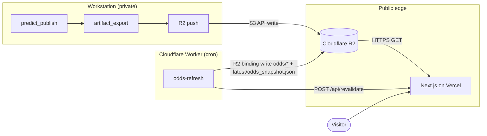

# ADR-ODDS-SNAPSHOT — Daily market odds snapshot beside Ridge forecasts

## Status

**Accepted** (operator-approved Phase 0, 2026-09-24). DESIGN / TASKS redlines
applied. L7 remains **OPEN** for counsel — production
`ODDS_SNAPSHOT_ENABLED=true` stays blocked until Phase 3 go-ahead.

## Context

Ridge has guaranteed, in `docs/webapp/DESIGN.md` and in public copy, that it
shows **no sportsbook lines**. Product decision (operator, 2026-09): reverse
that narrowly. Every current-week game may show a **market odds snapshot**
(consensus spread, total, and moneyline-implied win probability from The Odds
API) **next to** the model forecast on This Week (`/`) and Game Detail
(`/game/[gameId]`). Odds refresh automatically once a day.

What does **not** change:

- Ridge is still not a betting-recommendations product.
- No picks, edges, “value,” model-minus-market deltas, or wager CTAs.
- Results verdict stays **NOT CURRENTLY FIT TO BET** (artifact retained;
  banner display already off per clarity pass).
- The snapshot is context for reading the forecast only.

### Architecture already decided (do not relitigate)

Daily refresh = **Cloudflare Worker + Cron Trigger** → native R2 binding write
→ existing `/api/revalidate`. Rejected alternatives: Prefect on workstation
(manually gated; workstation downtime must not stop odds), Vercel Cron
(would put Odds API key / credit spend inside the webapp, breaking §3.5),
GitHub Actions cron (routinely delayed/skipped).

The odds snapshot is a **separate artifact** with its own schema and
staleness. It never touches `week_predictions.json`, `meta.json`,
`results_*.json`, `publish_history/`, tier state, or grading. An odds refresh
is not a publish and must not create a publish-history line or a pre-kickoff
snapshot for `grade_export`.

### Discovery summary (Phase 0)

| Item | Finding |
|------|---------|
| Ingest | `src/ncaa_quant/ingestion/odds_api.py` — live GET `/v4/sports/americanfootball_ncaaf/odds` |
| Sport / markets / regions | `americanfootball_ncaaf`; `h2h,spreads,totals`; `us` (`configs/data.yaml`) |
| Name map | `configs/team_names.yaml` under `odds_api:` — **184** YAML entries → **182** after casefold (`load_team_name_map`) |
| Unmapped names | Deterministic mascot-suffix strip, then whitespace-normalized original (`normalize_team_name`) — **never fuzzy** |
| Match | Exact mapped (home, away) + kickoff ±36 h; unordered swap with `swap_detected`; ambiguous → quarantined |
| Live `latest/*` schema | **1.3.0** (R2, 2026-09-23 week 4) |
| Fixtures | **1.2.0** (frozen; major still 1) |
| Odds API live cost | `markets × regions` = **3 credits/call** for `h2h,spreads,totals` + `us` |
| Attribution | Terms: *"Attribution to The Odds API is not required, but is always appreciated."* Display on websites/apps is permitted; resale as raw data feed is not |
| In-play | `/odds` returns upcoming **and** live; `commence_time < now` ⇒ in-play. Worker must exclude / carry-forward |

## Decision

1. **Ship `latest/odds_snapshot.json`** (schema `1.0.0`, independent of the
   predictions schema) written by Worker `workers/odds-refresh/`. Historical
   copies under `odds/{season}/w{week}/{YYYY-MM-DD}T{HH}.json`. Fixture /
   offseason routing writes under `sandbox/` only and skips revalidation
   (W7-TESTPUBLISH-GUARD posture).
2. **Narrow — do not delete — the Odds API exclusion** in §1.2: market numbers
   remain excluded from `week_predictions` and all other publish artifacts.
   Public display of consensus odds is allowed **only** via
   `odds_snapshot.json`.
3. **Team map for the Worker:** commit a JSON export of
   `configs/team_names.yaml` → `odds_api` into the Worker bundle (and keep the
   YAML as the workstation source of truth). Justification: the Worker must
   run when the workstation is down; an R2-only map would recreate the
   workstation dependency this feature exists to escape. Optional later:
   workstation may also push `latest/odds_team_map.json` as a secondary
   refresh, but the bundled map is authoritative for matching until that
   path is specified in a follow-on task. **Never fuzzy-match.**
4. **Frontend** behind `ODDS_SNAPSHOT_ENABLED` (default `false`). Odds file is
   optional: missing / fetch error / JSON error / unsupported odds major →
   hide odds UI silently; never MaintenanceState.
5. **Sign convention:** store and render market margin on the same
   home-minus-away scale as `mu_margin` (`market_home_margin =
   −median_home_spread`). Book notation only on Game Detail, labeled
   “Consensus spread.”
6. **Exception to §4.3 “no error-bar graphics”:** Game Detail may show one
   monochrome margin number line (model μ + 90% bracket + hollow market tick).
   No color encoding of agreement; `aria-label` reads the same facts.
7. **L7** added to §6.3 as OPEN for counsel before production enable.

## Proposed DESIGN redlines (not applied until approved)

### §1.1 Artifact inventory — add row

| File | Scope | Updated |
|------|-------|---------|
| `odds_snapshot.json` | Current-week consensus market odds (separate schema `1.0.0`) | Daily Worker cron (≈13:00 UTC) + manual `POST /run` |

Note under the table: odds snapshot has its **own** `snapshot_at` and is
**not** part of a publish generation’s shared `published_at`.

### §1.2 “Odds API / market-number exclusion” — replace paragraph

**Current:**

> **Odds API / market-number exclusion:** no spread, total, moneyline, book, or market-implied field appears in this contract. …

**Proposed:**

> **Odds API / market-number exclusion (narrowed):** no spread, total,
> moneyline, book, or market-implied field appears in `week_predictions.json`
> or any other *publish* artifact. Cover and over probabilities
> (`p_ats_home` / `p_ou_over`) remain internal only (ADR 0015).
> **Consensus sportsbook odds for the current week may appear on Ridge only
> via the separate `odds_snapshot.json` artifact** (ADR-ODDS-SNAPSHOT). That
> file is produced by the odds-refresh Worker, not by `predict_publish`, and
> must never be merged into `week_predictions`.

### §3.1 Data flow — extend diagram + sequence

Add a second subgraph:



Sequence addendum:

6. **Daily ≈13:00 UTC** — Worker reads `latest/meta.json` +
   `latest/week_predictions.json`, calls The Odds API once (~3 credits),
   writes odds keys, POSTs `/api/revalidate` with Bearer **and**
   `x-vercel-protection-bypass` (W7 lesson).

### §3.3 Security table — amend rows

| Asset | Exposure | Notes |
|-------|----------|-------|
| CFBD API key | **Workstation only** | Unchanged |
| Odds API key | **Workstation *and* Worker secret `ODDS_API_KEY`** | Never in Vercel / Next.js. Webapp still consumes zero Odds credits (§3.5) |
| R2 write (publish artifacts) | **Workstation only** | Unchanged |
| R2 write (odds keys) | **Worker R2 binding**, code-allowlisted to `odds/`, `latest/odds_snapshot.json`, `sandbox/` | Binding must not be used for `week_predictions`, `meta`, `results_*`, `publish_history/` |
| Revalidate secret | Workstation + Worker (same `WEBAPP_REVALIDATE_SECRET`) | Worker also sends protection-bypass header |

### §3.4 Cost table — add rows

| Line item | Free tier (2026) | Billing trigger | Ridge estimate |
|-----------|------------------|-----------------|----------------|
| Cloudflare Workers (cron) | 100k req/day class | Paid plan | 1–2 scheduled runs/day + rare manual |
| R2 Class A (Worker writes) | 10 M / mo | Writes | +2 objects/day (dated + latest) ≈ 60–90/mo |
| The Odds API credits | Plan quota | Overage | **~3 credits/day** per cron entry (`markets×regions`); note each added cron in Worker README |

Hard ceiling $20/mo unchanged; odds path stays inside free tiers at 1×/day.

### §3.5 Zero-credit statement — replace

**Current:** “The webapp **consumes no CFBD or Odds API credits**.”

**Proposed:**

> The **Next.js webapp** consumes no CFBD or Odds API credits. All CFBD spend
> remains on the workstation. Odds API spend for the public snapshot is
> incurred **only** by the Cloudflare odds-refresh Worker (~3 credits per
> scheduled run with `markets=h2h,spreads,totals&regions=us`). Vercel env must
> never hold `ODDS_API_KEY`.

### §5.1 This Week — add Market column rows

| UI element | Artifact field |
|------------|----------------|
| Page-level odds as-of line | `odds_snapshot.snapshot_at`, `odds_snapshot.source.provider` |
| Market margin (team-named) | `odds_snapshot.games[].market_home_margin` (+ home/away from `week_predictions`) |
| Market win prob | `odds_snapshot.games[].p_win_home_market` |
| Market O/U | `odds_snapshot.games[].total_points` |
| Carried-forward label | `odds_snapshot.games[].carried_forward` |
| Thin / absent market | `null` cells → "—"; `market_thin` |

No sort/filter by model-vs-market disagreement.

### §5.2 Game Detail — add “Model and market” block

Placed after Margin block, before trajectories:

| UI element | Artifact field |
|------------|----------------|
| Comparison table Model \| Market | `mu_margin` / `market_home_margin`; `mu_total` / `total_points`; `p_win_home` / `p_win_home_market` |
| Consensus spread (C2) | `spread_home_points`, `spread_book_count` |
| Margin number line | model interval + μ + market tick (ADR exception to §4.3) |
| Footnote | `consensus_method`, `snapshot_at`, book counts, provider attribution, link to `/results` |

σ-suppressed games: model column honest absence (§1.8); market still renders.

### §5.4 / About “what Ridge does not show” — proposed operator text

> Ridge shows a daily snapshot of sportsbook consensus odds for context. It
> does not compare them to its forecasts to suggest wagers, and does not
> publish picks, edges, or expected profits.

(Operator approves final text before Phase 2 copy land.)

### §6.1 Disclaimer — proposed operator text

> **Ridge** publishes automated college football **forecasts with uncertainty**
> from a private statistical model. These are **not** betting recommendations.
> Ridge shows a daily snapshot of sportsbook consensus odds for context. It
> does not compare them to its forecasts to suggest wagers, and does not
> publish picks, edges, or expected profits. Forecasts can be wrong. Past
> interval hit rates and track-record metrics do not guarantee future
> performance. For entertainment and informational purposes only. © {year} Ridge.

### §6.3 — new flag L7 (OPEN)

| ID | Item | Notes for counsel |
|----|------|-------------------|
| L7 | **Sportsbook odds display** | Public display of The Odds API consensus odds (no individual book names, logos, prices, or affiliate links). Confirm: (a) Odds API display terms satisfied by optional attribution + non-resale posture; (b) state-level gambling-adjacent content rules for an informational forecasting site that now surfaces sportsbook consensus numbers; (c) whether responsible-gambling copy (§6.2) remains sufficient. **Status: OPEN — production `ODDS_SNAPSHOT_ENABLED=true` blocked until sign-off.** |

Launch / production-enable blocked on L7 (in addition to prior L1–L3 posture as applicable).

## Proposed TASKS.md redline

**Explicitly out of scope** — strike the Odds display line; keep edges/Kelly/CLV:

```diff
- Betting recommendations, picks, edges, Kelly, CLV UI
- Odds API or sportsbook line display
+ Betting recommendations, picks, edges, Kelly, CLV UI
  MLflow / Prefect / workstation public exposure
```

(Or replace the struck line with: “Model-minus-market edges / value UI;
individual sportsbook names, logos, affiliate links.”)

## Grep-gate / copy allowlist changes (exact proposal)

The published-copy union
(`scripts/check_betting_language.py` / `webapp/site/scripts/check-published-copy.mjs`)
is:

```text
best bet | yes bet | \bplay\b | edge vs market | \bunits\b
| lock it in | must bet | recommended bet
```

**Do not narrow the union.** Proposed copy must avoid those phrases.
Specifically:

| Surface | Change |
|---------|--------|
| `DISCLAIMER_TEMPLATE` (§6.1) | Replace “does not publish sportsbook lines, implied edges, …” with approved §6.1 text above. Avoid the substring `edge vs market`. Prefer “edges” only inside “does not publish … edges …” refusal. |
| `WHAT_RIDGE_WONT_SHOW_PARAGRAPHS` | Replace “doesn't publish picks, sportsbook lines, or betting advice… they stay off the site” with approved §5.4 text (snapshot for context; no comparison / no picks / edges / expected profits). |
| `FOOTER_DISCLAIMER_SHORT` | Replace “No lines, picks, or edge claims.” → e.g. “Forecasts with uncertainty — not betting recommendations. Consensus odds for context only — no picks or edge claims.” |
| First-visit banner | Uses `DISCLAIMER_TEMPLATE` — inherits §6.1 change. |
| `about.test.tsx` | Update assertion that currently requires `"does not publish sportsbook lines"`. |
| New About attribution line (optional, appreciated) | e.g. `Odds data: The Odds API (the-odds-api.com).` — does not hit the union. |
| `artifact-market-fields.test.ts` / `payload-leak.test.tsx` | **Unchanged** for `week_predictions` / RSC prediction payloads. New odds DTO fields live only under the odds snapshot path and must not appear inside `GamePrediction`. |
| Ratchet baselines (`BASELINE_MATCHES` etc.) | Re-measure after copy edits; expect notes/ADR quoting may shift counts — bump pins in the same PR. |

No new path needs adding to `ALLOWED_PATHS` in `eslint-plugin-ridge` for this
feature unless number formatting escapes `lib/formatting` (it must not).

## Consequences

- Public site can show market context without publishing edges or book names.
- Worker independence from workstation removes a single point of failure for
  odds freshness; site-side 30 h / 72 h staleness labels remain the second
  backstop.
- L7 counsel sign-off gates production flag flip (Phase 3).
- ADR 0015 (cover/over unpublished) remains in force; this ADR does not
  restore `p_cover_home` / `p_over`.

## References

- Task brief: W-ODDS Phase 0
- `docs/webapp/DESIGN.md`, `docs/webapp/TASKS.md`
- `docs/notes/webapp-w6.md`, `docs/notes/webapp-w7.md`
- `src/ncaa_quant/ingestion/odds_api.py`, `src/ncaa_quant/ingestion/teams.py`
- `configs/team_names.yaml`, `configs/data.yaml`
- The Odds API v4 docs; Terms (last updated 31 August 2026)
